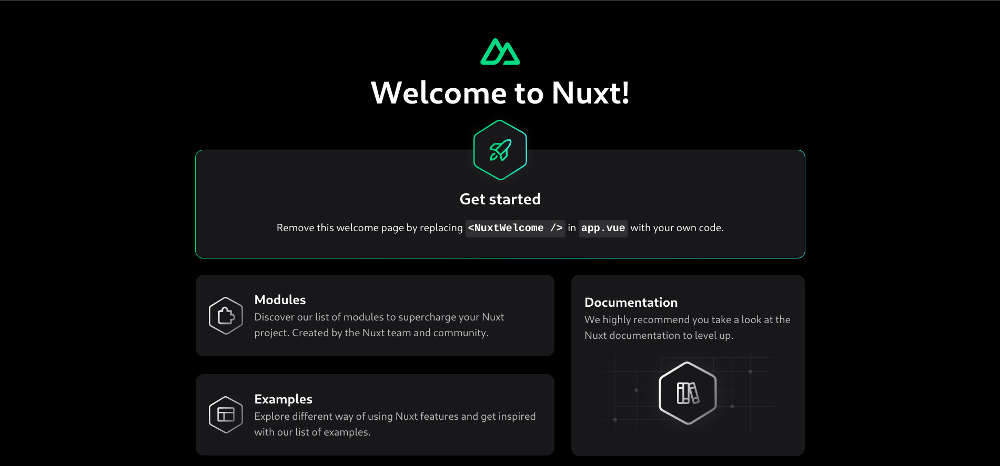

# Nuxt Example

Deploy your [Nuxt](https://nuxt.com) project to Vercel with zero configuration.

[](https://vercel.com/new/clone?repository-url=https://github.com/vercel/vercel/tree/main/examples/nuxtjs&template=nuxtjs)

_Live Example: https://nuxtjs-template.vercel.app_

Look at the [Nuxt 3 documentation](https://v3.nuxtjs.org) to learn more.

## Setup

Make sure to install the dependencies:

```bash
# yarn
yarn

# npm
npm install

# pnpm
pnpm install --shamefully-hoist
```

## Development Server

Start the development server on http://localhost:3000

```bash
npm run dev
```

## Production

Build the application for production:

```bash
npm run build
```

Locally preview production build:

```bash
npm run preview
```

Checkout the [deployment documentation](https://nuxt.com/docs/getting-started/deployment#presets) for more information.


## Screenshot 📸




## Languages and Tools are used 🗣️🔧

1. **Languages** 🗣️
    + [TypeScript](https://github.com/topics/typescript)
    + [Yarn](https://github.com/topics/yarn)
    + [Vue](https://github.com/topics/vue)
    + [Nuxtjs](https://github.com/topics/nuxtjs)

2. **Tools** 🔧
    + [Chrome](https://github.com/topics/chrome)
